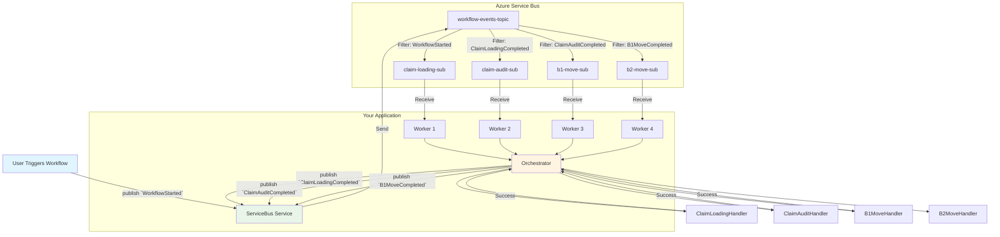

# Architecture Guide - Azure Service Bus Event-Driven Job Chaining

## High-Level Architecture (Pub/Sub)

## Why Pub/Sub?

Instead of tightly coupling `ClaimLoading` to `ClaimAudit` via individual queues, we use an **Event-Driven Architecture**.
1. Jobs publish **Events** (e.g. `ClaimLoadingCompleted`) to a single generic Topic.
2. Other jobs **Subscribe** to events they care about via SQL Filters.
3. This decouples the components - you can add a `SendEmailNotification` subscriber to `ClaimLoadingCompleted` without changing the existing workflow.

---

### Component Overview

#### [src/config.ts](file:///c:/Workspace/POCs/AzureServiceBusJobChaining/src/config.ts)
The central configuration. Defines the 1 Topic (`workflow-events-topic`) and 4 Subscriptions.

#### [src/models/WorkflowEvent.ts](file:///c:/Workspace/POCs/AzureServiceBusJobChaining/src/models/WorkflowEvent.ts)
The payload sent across the Service Bus. Includes the critical `eventType` property which Azure uses for routing.

#### [src/services/ServiceBusService.ts](file:///c:/Workspace/POCs/AzureServiceBusJobChaining/src/services/ServiceBusService.ts)
The Azure Service Bus communicator. `publishEvent()` sets the `eventType` as a message Application Property, allowing Azure's SQL Filters to properly route the message to the right subscription.

#### [src/services/WorkflowOrchestrator.ts](file:///c:/Workspace/POCs/AzureServiceBusJobChaining/src/services/WorkflowOrchestrator.ts)
Receives an event, finds the right handler via `JobHandlerFactory`, and publishes the NEXT event (the completion event) back to the Service Bus.

#### [src/scripts/setup-infrastructure.ts](file:///c:/Workspace/POCs/AzureServiceBusJobChaining/src/scripts/setup-infrastructure.ts)
Creates the Topic, the Subscriptions, and specifically deletes the `$Default` allow-all rule and replaces it with SQL Rules (e.g. `eventType = 'WorkflowStarted'`).

## Complete Event Flow

1. User triggers workflow.
2. System publishes `WorkflowStarted` to the Topic.
3. Azure routes it to the `claim-loading-sub` matching the SQL Filter.
4. `ClaimLoadingHandler` executes.
5. Orchestrator publishes `ClaimLoadingCompleted` to the Topic.
6. Azure routes it to the `claim-audit-sub` matching the SQL Filter.
7. Event propagation continues until the final handler finishes.
